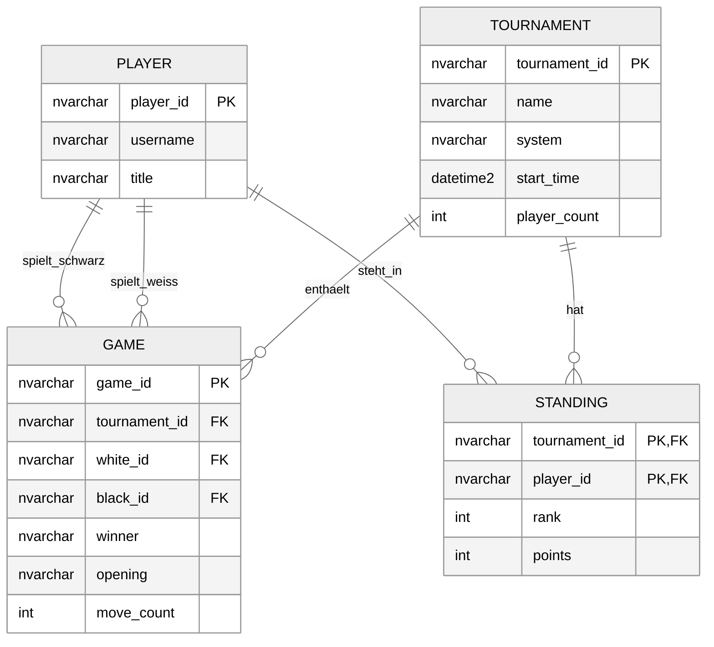

# Lichess Tournament Pipeline (M164)

A Node.js application for the **M164** module (databases). It fetches public
**Lichess arena tournament** data, transforms the nested JSON into flat relational
rows, writes CSV files, bulk-loads them into a **SQL Server 2022 Express** database,
and shows the result in a small web dashboard (the "analysis board").

The web UI lets you browse finished tournaments, import the ones you pick (data
**accumulates** across imports), view dashboard statistics, see the ER diagram, and
reset the database.

---

## What it does

- Fetches arena tournaments from the Lichess public API.
- Transforms them into four tables: `tournament`, `player`, `game`, `standing`.
- Imports via server-side `BULK INSERT` from generated CSVs.
- Dashboard: winner distribution as an engine **eval-bar**, most frequent openings and
  most active players as ranked bars, and the ER diagram.
- Exports the data to an Excel (`.xlsx`) workbook.

## Tech stack

- **Node.js 24** (ES Modules). Environment variables are loaded with Node's built-in
  `--env-file=.env` (no `dotenv` package needed).
- **SQL Server 2022 Express** (named instance `SQLEXPRESS`).
- Dependencies: `mssql`, `express`, `exceljs`.

---

## Setup (4 steps)

### Prerequisites

1. **Node.js 24** - check with `node --version`.
2. **SQL Server 2022 Express** installed and running.
3. **TCP/IP enabled** and **SQL Server Browser running** - open *SQL Server Configuration
   Manager*, enable TCP/IP under *Protocols for SQLEXPRESS*, start *SQL Server Browser*,
   and restart the SQL Server service. (One-time, needed to reach the named instance.)

### The steps

```bash
# 1. Get the code
git clone <repo-url>
cd lichess-pipeline

# 2. Install dependencies
npm install

# 3. Interactive setup - creates .env and the database
npm run init

# 4. Start the web server
npm start
```

`npm run init` asks one question:

- **Windows Authentication (recommended)** - connects as your Windows user. Works if
  SQL Server Express is installed locally and you ran the installer as an admin. No extra
  SQL configuration needed.
- **SQL Authentication** - creates a `lichess_app` SQL login automatically. You will be
  asked for an admin login (e.g. `sa`) to create it, then a password for the new login.
  Requires mixed-mode authentication to be enabled in SQL Server: SSMS, right-click
  server, *Properties*, *Security*, "SQL Server and Windows Authentication mode", then
  restart the service.

Then open **http://localhost:3000**.

> On first start the dashboard is empty. Click **Turniere laden**,
> pick a tournament, and **Ausgewählte importieren**.

---

## Using it

- **Turniere laden** - loads the list of recently finished tournaments. Ones already in
  the database are shown checked, locked, and badged "importiert".
- **Ausgewählte importieren** - imports the tournaments you ticked. Importing **adds** to
  what's already there (re-importing the same tournament is a no-op).
- **Datenbank zurücksetzen** (bottom of the import panel) - wipes all imported data after
  an inline confirmation.

## Command reference

All commands read `.env` automatically.

| Command | What it does |
|---|---|
| `npm start` | Start the web server at http://localhost:3000 |
| `npm run setup` | Create the database + empty tables (also empties an existing DB) |
| `npm run reset` | Same as setup, empties the tables |
| `npm run import -- <id> [<id> ...]` | Import tournaments from the command line |
| `npm run verify` | Print sample joined rows and check for orphaned games |
| `npm run export` | Export the data to `…/data/export.xlsx` |
| `npm run teardown` | Drop the whole database |

Example: `npm run import -- abcd1234 efgh5678`

---

## Data model

Four tables with **natural keys** (the source IDs are stable, so no surrogate IDs are
needed and `BULK INSERT` is simpler). Players are deduplicated across all tournaments by
lowercased id.



## The three analysis queries

These power the dashboard (`src/queries.js`).

**Winner distribution**
```sql
SELECT winner, COUNT(*) AS count
FROM game
GROUP BY winner
ORDER BY count DESC;
```

**Most frequent openings**
```sql
SELECT ISNULL(opening, 'Unknown') AS opening, COUNT(*) AS count
FROM game
GROUP BY opening
ORDER BY count DESC;
```

**Most active players** (games as white + games as black)
```sql
SELECT player_id, COUNT(*) AS count FROM (
  SELECT white_id AS player_id FROM game
  UNION ALL
  SELECT black_id AS player_id FROM game
) AS both
GROUP BY player_id
ORDER BY count DESC;
```

---

## Project structure

```
src/
  index.js       CLI entry point (setup | teardown | import <ids> | verify | export)
  server.js      Express server: static files + /api routes
  pipeline.js    runImport(ids): fetch -> transform -> CSV -> ensure schema -> merge load
  lichess.js     Lichess API calls + transformTournament()
  database.js    DB library: schema, merge import, reset, verify, export
  queries.js     Read-only query layer (the three dashboard stats + imported IDs)
  csv.js         CSV writing
  export.js      XLSX export
public/
  index.html     Dashboard page
  app.js         Browser logic (stats, import, reset)
  styles.css     Design system / styling
db-setup.sql     One-time SQL login + permissions
.env.example     Template for your .env
```

---

## Troubleshooting

- **Cannot connect / instance not found** - TCP/IP not enabled, or SQL Server Browser
  not running. Both are required to reach a named instance (see step 3 of Setup).
- **Login failed for user 'lichess_app'** (SQL auth path) - mixed-mode authentication is
  off. Enable it in SSMS under server *Properties* > *Security*, then restart the service.
  Re-run `npm run init` to recreate `.env` and the login.
- **Login failed for Windows user** (Windows auth path) - your Windows account may not
  have `sysadmin` rights on the instance. Open SSMS, connect as `sa`, and grant your
  account the `sysadmin` role under *Security > Logins*.
- **`You do not have permission to use the bulk load statement`** - the login is missing
  the `bulkadmin` role. Re-run `npm run init` (SQL auth path) to re-grant it, or run
  `db-setup.sql` manually in SSMS.
- **`Cannot bulk load. Operating system error … Access is denied`** - SQL Server reads
  the CSVs server-side from `C:\Users\Public\Projects\M164-Lichess-Pipeline\data`. The
  app creates this folder automatically, but on a locked-down machine the SQL Server
  service account may need read access to it.
